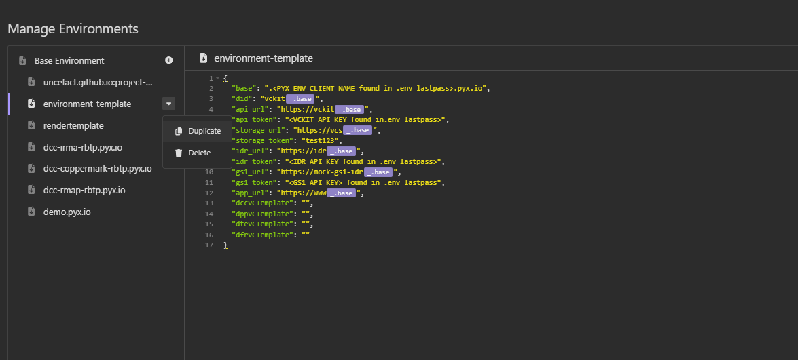

# insomnia-template-api-calls
Repository to track changes &amp; version control for Insomnia UNTP API Calls using built-in Insomnia Git Integration tool.

## Getting Started

Follow the steps below to clone the repository in Insomnia:

1. Create a new project in Insomnia and name it appropriately.
2. Select **Git Sync** as the project type.
3. Set the repository to `pyx-industries/insomnia-template-api-calls` and the branch to `master`.
4. Clone the repository.

## Development Workflow

1. A `development` branch needs to be created every time you're making updates to the Insomnia calls.
3. The `master` branch is the main branch for tracking changes.
4. Before making any updates, ensure the repository is up to date by pulling the latest changes.
5. Create a development branch using the naming format 'username-dev-001', incrementing the number with each new branch.
6. Insomnia will automatically detect any modifications and display them in the bottom-left corner.
8. After completing your updates, commit and push the changes to your development branch in the remote repository.
9. Once you’re satisfied with the committed changes, raise a pull request and assign a reviewer for peer review, then request a merge into the master branch.

## Creating global environments from template
1. Make a copy of the blank environment-template and rename it to match your environment (e.g. rbtp.pyx.io).

2. Update the tokens using the values provided in the .env file stored in LastPass.
3. To obtain the environment tokens, request BizCubed to share them securely via LastPass.
*(For BizCubed users, refer to the “Communicating Passwords to Clients” wiki for guidance on securely sharing LastPass items.)*

## Issuing credentials
1. Select the environment accordingly at the top left corner.
2. Then, depending on credential you want to issue, choose the corresponding folder (DPP/DFR/DCC/DTE).
3. Click on the 002 - Issue Credential HTTP request and replace the value of “credentialSubject” with the JSON Instance that you have prepared.
4. Issue the Insomnia calls:
  - 001 - Issue Revocation Token - This is so that we can activate / revoke the VC - More details in https://uncefact.github.io/project-vckit/docs/get-started/api-server-get-started/basic-operations#issuing-a-status-vc
  - 002 - Issue Credential - This is the API call that will issue the VC. The result won’t be human readable.
  - 003 - Verify Credential - This is the API call to verify that the VC has been issued.
  - 004 - Store Credential - This is to store the issued VC to the storage.
  - 004.1 - View Credential - You don’t need to run this API call, it will just show a blank page in the Insomnia preview. This is to get the link to view the VC. You can get it by clicking on the arrow next to the Send button and click on “Generate Client Code”. Then, another window will show up with the full URL to view the VC.
  - 005 - Register in Resolver. This is the API call to link your issued VC to a IDR. For the IDR path, it will be using the following value from your issued VC as identificationKey.
  - 006 - Validate Resolve Registry. This API call is to validate that the VC has been successfully registered with the IDR link and is resolvable.
